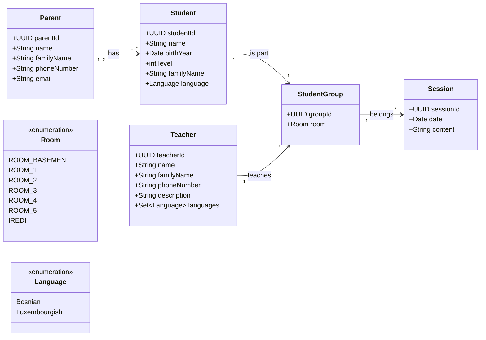

# 🏫 School Management System (REST API)

[](https://openjdk.org/)
[](https://spring.io/projects/spring-boot)
[](https://junit.org/junit5/)
[](http://localhost:8080/swagger-ui/index.html)

A domain-driven, resilient enterprise REST API built to manage students, teachers, parents, and academic groups. Architected with strict adherence to **Clean Architecture**, **Immutability**, and **isolated controller slice testing**.

---

---

## 🎯 Real-World Domain Expertise & Problem Statement

This system was engineered from **firsthand operational experience**: Having served as an **instructor for two years** at a local community education center (weekend school), I experienced the daily administrative bottlenecks directly.

Weekly attendance tracking, multilingual parent communications, and student progress evaluations were handled through fragmented paper sheets and disparate spreadsheets.

This insider domain knowledge directly shaped the software architecture and entity modeling:

* **Domain-Driven by Experience:** System requirements and constraints are grounded in two years of active classroom and administrative operations, not hypothetical mockups.
* **Headteacher Operational Overview:** Centralized visibility enabling leadership to monitor active sessions, group allocations, and holistic student performance.
* **Attendance & Presence Tracking:** Granular `Session` logging designed to replace physical paper lists with digital, queryable attendance and curriculum records.
* **Multilingual Demographics:** Built-in tracking of linguistic proficiencies (e.g., Bosnian, Luxembourgish) to automate structured class allocations based on language levels.
---

## 🏛️ Architectural Highlights & Engineering Principles

* **Clean Architecture & SOLID:** Strict three-tier separation (`Controller` ➔ `Service` ➔ `Repository`). Domain entities are isolated from the web layer; external communication relies exclusively on Data Transfer Objects.
* **Immutability by Default:** Enforced through modern **Java Records** for all request and response payloads, ensuring thread safety, zero boilerplate, and value-based semantics.
* **Constructor-Based Dependency Injection:** Complete elimination of `@Autowired` field injection to ensure deterministic testability and prevent circular dependencies.
* **Standardized Error Handling:** Centralized exception handling via `@RestControllerAdvice` adhering strictly to **RFC 7807** (`ProblemDetail`).

## 📐 Domain-Modell (UML)


---

## 🧪 Testing Strategy (Isolated Slice Testing)

The presentation layer is covered with **100% isolated slice tests** using `@WebMvcTest` and Jayway `jsonPath`:

* **Zero Spring Context Bloat:** Slices execute in milliseconds by isolating HTTP routing, argument extraction, and serialization without starting JPA or database infrastructure.
* **Strict Verification:** State verification on HTTP status codes (200, 201, 204), response headers, nested JSON arrays (`$[0]`), and explicit Mockito invocations (`verify(..., times(1))`).

### Web-Layer Test Coverage:
| Controller | Scope & Operations | Coverage |
| :--- | :--- | :--- |
| `StudentController` | CRUD, Soft-Deletion, Language Search | **100%** ✅ |
| `TeacherController` | CRUD, Soft-Deletion, Language Mapping | **100%** ✅ |
| `ParentController` | CRUD, Inactive Account Queries | **100%** ✅ |
| `StudentGroupController` | Dual Path-Variable Assignments, Group Allocations | **100%** ✅ |

---

## 🚀 Tech Stack

* **Language:** Java 21 (Records, Pattern Matching, Modern Collections)
* **Framework:** Spring Boot 3 (Spring Web MVC, Spring Data JPA)
* **Database:** H2 (In-Memory Development) / PostgreSQL ready
* **Testing:** JUnit 5, Mockito, Spring Test (`MockMvc`), Jayway JSONPath, AssertJ
* **Documentation & Tooling:** SpringDoc OpenAPI 3, Swagger UI, Maven

---

## ⚡ Quick Start & Interactive Demo

### 1. Run the Application
```bash
./mvnw clean spring-boot:run
```

---

## 🗺️ Engineering Roadmap & Architectural Evolution

### 📍 Phase 1: Architecture & Web Slice Isolation (Completed ✅)
* [x] **Domain-Driven Modeling:** Translated 2 years of classroom operations into a cohesive UML schema (Sessions, Presences, Multi-Language Profiles).
* [x] **Clean Architecture Core:** Enforced 3-tier layering (`Controller` ➔ `Service` ➔ `Repository`) with strict Entity/DTO boundary separation.
* [x] **Immutability First:** Standardized all Request/Response contracts on **Java Records**, eliminating mutability bugs and boilerplate.
* [x] **100% MockMvc Slice Testing:** Isolated HTTP verification via `@WebMvcTest`, mocking downstream dependencies with Mockito to ensure sub-second feedback loops.
* [x] **API Contract & Documentation:** Integrated and customized OpenAPI 3 / Swagger UI with custom metadata and dark styling.
* [x] **Git Flow & Code Review Discipline:** Enforced branch protection habits using atomic conventional commits and Pull Request merges.

---

### 📍 Phase 2: Core Domain Logic & Service Testing (In Progress 🟡)
* [ ] **Service-Layer Unit Testing:** 100% isolation testing using `@ExtendWith(MockitoExtension.class)` without Spring context overhead.
* [ ] **Business Invariant Enforcement:** Validate domain rules (e.g., student capacity limits, language-group allocations, active session constraints).
* [ ] **RFC 7807 Global Exception Handling:** Mapping domain exceptions into standardized `ProblemDetail` payloads via `@RestControllerAdvice`.

---

### 📍 Phase 3: Automated Quality Engineering & CI/CD (Planned ⚪)
* [ ] **Automated Code Coverage (JaCoCo):** Enforce strict coverage thresholds (>80% instruction and branch coverage) during `mvn verify`, failing builds on regression.
* [ ] **Static Code Analysis (SonarQube):** Automated detection of code smells, cyclomatic complexity, security vulnerabilities, and technical debt.
* [ ] **GitHub Actions Quality Gate:** Fully automated CI pipeline executing build, JaCoCo report generation, and Sonar analysis on every Pull Request.

---

### 📍 Phase 4: Enterprise Security & Role-Based Access Control (Planned ⚪)
* [ ] **Stateless Authentication:** Spring Security 6 integration with asymmetric JWT (JSON Web Tokens) verification.
* [ ] **Hierarchical RBAC Schema:**
    * `ROLE_HEADTEACHER`: System-wide administration, group scheduling, and audit telemetry.
    * `ROLE_TEACHER`: Scoped write-access to assigned sessions, attendance checklists, and grading.
    * `ROLE_PARENT`: Relationship-bound read access strictly limited to their own children via relational ownership validation.
    * `ROLE_STUDENT`: Self-service portal view for personal curriculum, homework, and session timetables.
* [ ] **Method-Level Security:** Enforcing `@PreAuthorize` with custom Spring Expression Language (SpEL) evaluators for resource ownership verification.

---

### 📍 Phase 5: Event-Driven Parent Notification Microservice (Planned ⚪)
* [ ] **Asynchronous Event-Driven Decoupling:** Publish domain events (`HomeworkPublishedEvent`, `CurriculumLagDetectedEvent`, `SchoolEventScheduledEvent`) via RabbitMQ / Apache Kafka.
* [ ] **Multi-Channel Dispatcher:** Independent notification worker handling SMTP (JavaMailSender) and SMS/Messaging gateways (Twilio API).
* [ ] **Academic Progress Monitoring:** Domain scheduler computing curriculum progress deltas to proactively notify parents when a student requires targeted assistance.
* [ ] **Fault Tolerance & Resilience:** Dead Letter Queues (DLQ) and retry policies preventing notification failures from degrading core school operations.

---

### 📍 Phase 6: Modern Client Layer (Planned ⚪)
* [ ] **SPA Frontend Architecture:** Evaluating **Angular** (enterprise-grade modularity, strict TypeScript, built-in dependency injection) vs. **React** (flexible component ecosystem, lightweight state management).
* [ ] **Headteacher & Teacher Dashboards:** Real-time presence toggles, student grading overviews, and group assignment matrix.
* [ ] **Parent Portal:** Mobile-optimized view for attendance history, homework tracking, and school announcements.